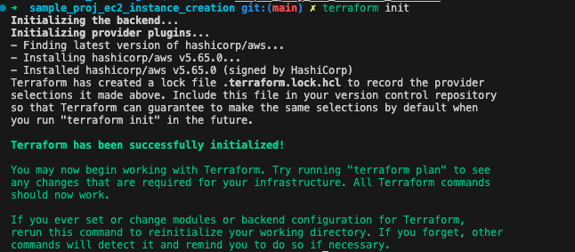
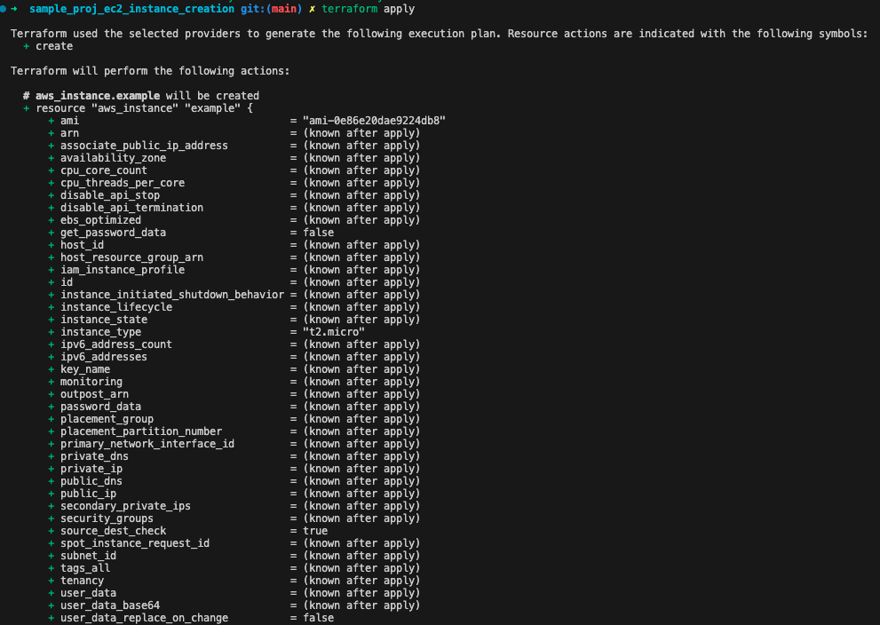
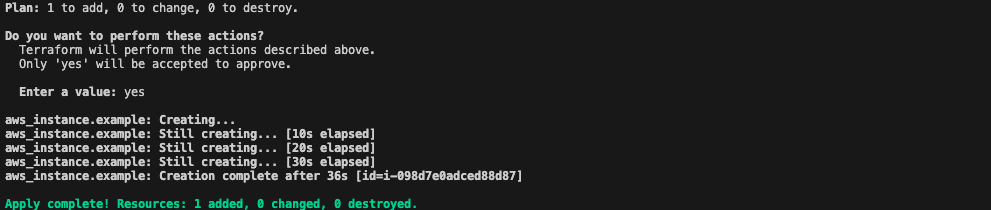
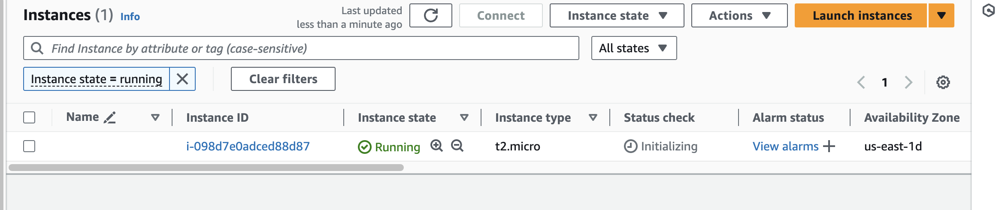
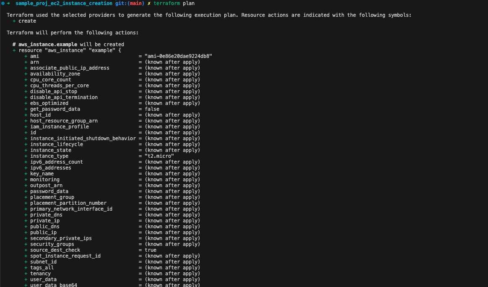
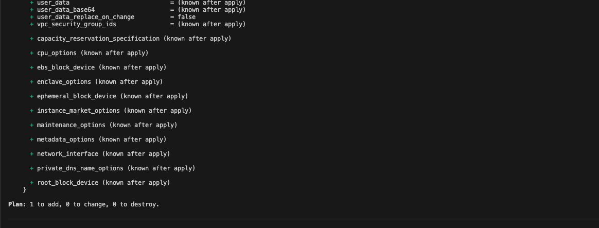
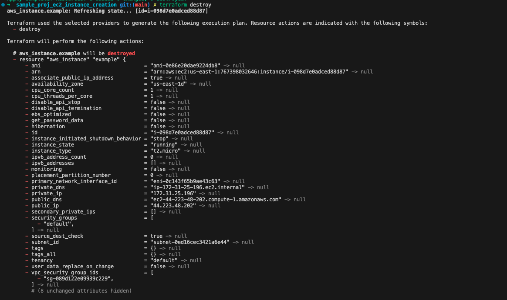
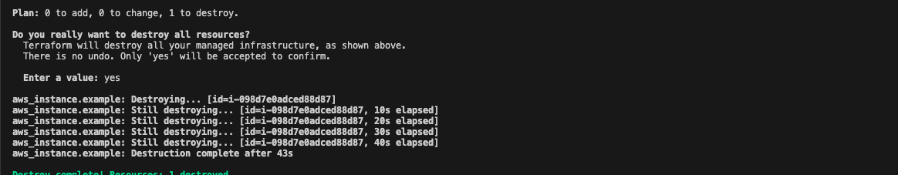
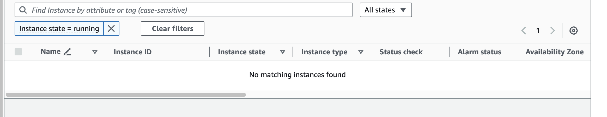

This ia a terraform starter project
terraform init

- this will initialize a teraform project

terraform apply
 - this will create ec2 instance on your aws account
 
 

 

 terraform plan

 
 

 terraform destroy
 - this will destroy the instance created above by terraform
 
 
 
 

