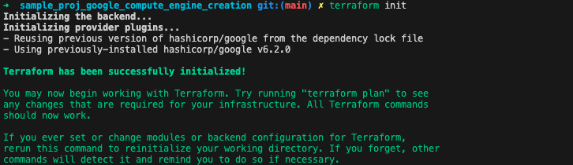
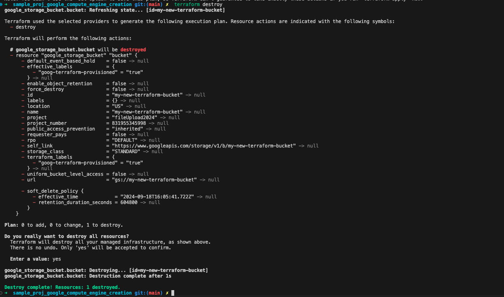
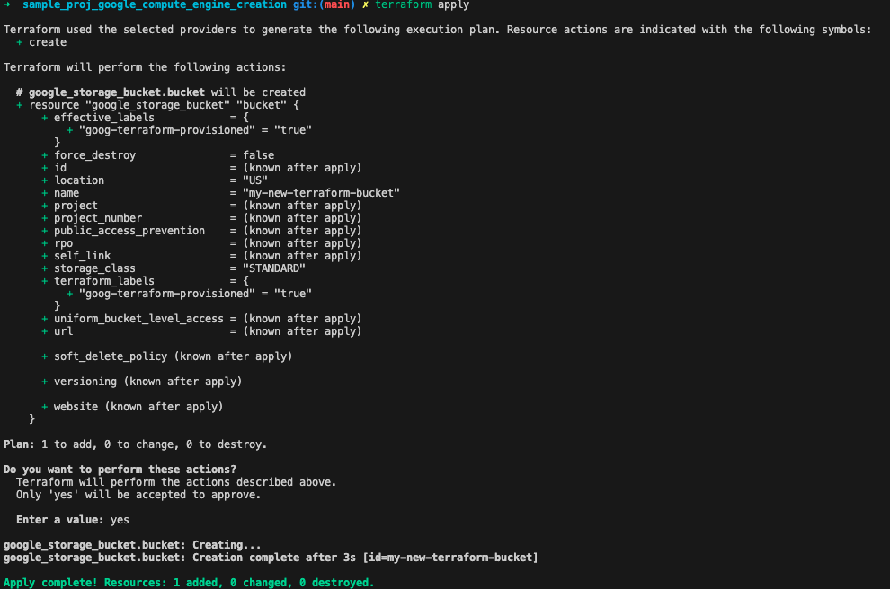
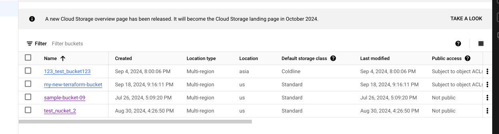

This ia a terraform starter project for creating bucket on google cloud

terraform init
- this will initialize a teraform project

 terraform plan

terraform apply
 - this will create ec2 instance on your aws account

 terraform destroy
 - this will destroy the instance created above by terraform

